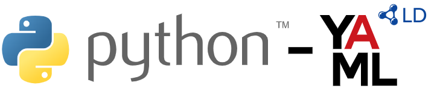

# python-yaml-ld

<!--


-->



A Python implementation for handling YAML-LD documents. Basically, a wrapper on top of [digitalbazaar/pyld](https://github.com/digitalbazaar/pyld).

## What is YAML-LD?

YAML-LD is a YAML-based serialization for Linked Data, drawing inspiration from [JSON-LD](https://json-ld.org/). It aims to bring the ease of YAML along with the structured linked data principles of JSON-LD. The [YAML-LD specification](https://json-ld.github.io/yaml-ld/spec/) provides detailed information on the structure and usage of YAML-LD.

## For whom is this library?

For Python developers who are interested in parsing and transforming YAML-LD data.

## Installation

```shell
pip install yaml-ld
```

## Functions

* [`yaml_ld.expand()`](https://python-yaml-ld.iolanta.tech/expand/)
* [`yaml_ld.compact()`](https://python-yaml-ld.iolanta.tech/compact/)
* [`yaml_ld.flatten()`](https://python-yaml-ld.iolanta.tech/flatten/)
* [`yaml_ld.frame()`](https://python-yaml-ld.iolanta.tech/frame/)
* [`yaml_ld.to_rdf()`](https://python-yaml-ld.iolanta.tech/to-rdf/)
* [`yaml_ld.from_rdf()`](https://python-yaml-ld.iolanta.tech/from-rdf/)

See [Docs](https://python-yaml-ld.iolanta.tech) for more details.

## Contributing

* Clone the repository
* Set up a Python virtual environment
* Install Poetry:

```shell
pip install -U pip poetry
```

* Install the project:

```shell
poetry install
```

* Retrieve submodules:

```shell
j update-submodule
```
