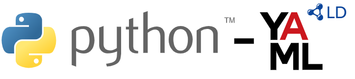

# YAML-LD implementation for Python

A Python implementation for handling YAML-LD documents.

## What is YAML-LD?

YAML-LD is a YAML-based serialization for Linked Data, drawing inspiration from [JSON-LD](https://json-ld.org/). It aims to bring the ease of YAML along with the structured linked data principles of JSON-LD. The [YAML-LD specification](https://json-ld.github.io/yaml-ld/spec/) provides detailed information on the structure and usage of YAML-LD.




